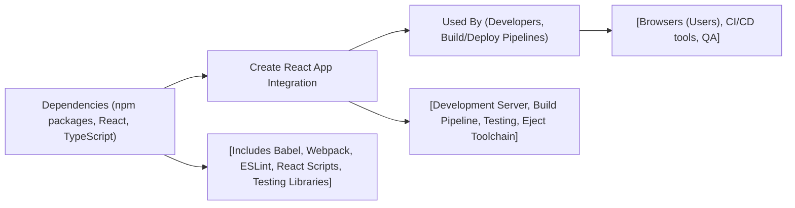

# Create React App Integration

## Overview
This module provides the full integration of [Create React App](https://github.com/facebook/create-react-app) within the project, enabling rapid development, testing, and deployment of React-based UI applications. It acts as the cornerstone for initializing, building, serving, and testing the front-end, handling all the tooling and environment setup required for modern web app development.

## Key Features
- **Development Server**: Instantly preview React applications locally with hot reloading via `npm start`.
- **Production Build**: Generate highly optimized static assets for deployment using `npm run build`.
- **Testing Framework**: Seamless unit and integration testing support with built-in scripts and [React Testing Library](https://testing-library.com/).
- **Configurable Toolchain**: Ability to fully eject (via `npm run eject`) to customize Webpack, Babel, ESLint, and more, if the default setup does not suffice.
- **Typescript Support**: Out-of-the-box support for TypeScript, ensuring type-safe development.
- **Modern JavaScript ECMAScript Support**: Compiles advanced JS syntax for broad browser compatibility.
- **Environment-based Configuration**: Handles different settings for development and production automatically.

## System Errors
- **Port Already In Use**: Occurs if another process uses port 3000.  
  *Resolution*: Stop the conflicting process or set a different port (`PORT=xxxx npm start`).
- **Build Failures (Syntax/Module Not Found)**: Caused by code or import errors.  
  *Resolution*: Check the console output for detailed error messages; fix code or missing files.
- **Dependency Version Conflicts**: When incompatible versions are installed.  
  *Resolution*: Delete `node_modules` and `package-lock.json`, then run `npm install` to resolve.
- **Jest/Testing Errors**: Tests may fail due to incorrect implementation or missing mocks.  
  *Resolution*: Inspect test outputs, verify test code and component setup.

## Usage Examples

```bash
# Start the development server with hot reload
npm start

# Run the automated test suite interactively
npm test

# Build the production-ready, optimized app
npm run build

# Eject from Create React App to customize the configuration (irreversible)
npm run eject
```

```typescript
// src/App.tsx (example usage of TypeScript support in a Create React App scaffold)
import React from "react";

const App: React.FC = () => (
  <div>
    <h1>Welcome to Bimbamjob</h1>
    <p>This UI is powered by Create React App.</p>
  </div>
);

export default App;
```

## System Integration


