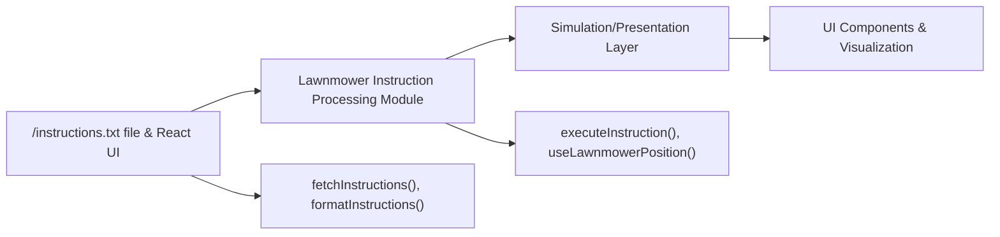

# Lawnmower Instruction Processing

## Overview
The Lawnmower Instruction Processing module enables the simulation and visual tracking of multiple robotic lawnmowers as they navigate a defined area. It is responsible for fetching, parsing, and executing sets of movement instructions for each lawnmower, ensuring they adhere to area boundaries and visualizing their positions step by step. This module acts as an integration layer between user-provided instructions (typically from a file), internal simulation logic, and presentation layers in the system.

## Key Features
- **Instruction Fetching**: Downloads and retrieves instruction sets (from files such as `/instructions.txt`) to drive the simulation.
- **Instruction Formatting**: Converts raw instruction text into structured JavaScript objects with area size, mower positions, and steps.
- **Instruction Execution**: Calculates and updates the mower's next position based on rotation (`L`, `R`) and forward (`F`) commands, strictly obeying area boundaries.
- **Lawnmower Position State Management**: Provides a React hook (`useLawnmowerPosition`) to manage animated state progression of each mower, supporting visual UIs and step-based execution.

## System Errors
- **Fetch Error**: If the `/instructions.txt` file cannot be loaded (e.g., due to a 404 or network error), no lawnmower simulation can occur.  
  _Resolution_: Check the instructions file path and network connectivity.
- **Malformed Instructions**: If instructions are not properly formatted (incorrect lines, unsupported commands), parsing will fail and mowers will not operate properly.  
  _Resolution_: Ensure instructions follow the expected format (area size, mower definition, instruction line).
- **Invalid Movement**: When an instruction attempts to move the mower outside the defined area, the move is ignored.  
  _Resolution_: No user action needed; the module automatically prevents illegal moves.

## Usage Examples

```typescript
// Example usage: Fetch and simulate mowers
import { fetchInstructions } from 'src/utils/fetchInstructions';
import useLawnmowerPosition from 'src/hooks/useLawnmowerPosition';

async function simulateAllMowers() {
  const instructions = await fetchInstructions(); // loads and parses instruction file

  instructions.lawnMowers.forEach((lawnMower, idx) => {
    // Inside a React component, per mower:
    const { position, showFinalPosition } = useLawnmowerPosition({
      lawnMower,
      areaWidth: instructions.areaWidth,
      areaHeight: instructions.areaHeight,
      index: idx,
      active: idx === 0, // activate first mower for demo
      setActiveLawnMower: (nextIdx) => { /* switch to next mower on completion */ },
    });

    // React components can render position and orientation updates
  });
}
```

## System Integration


