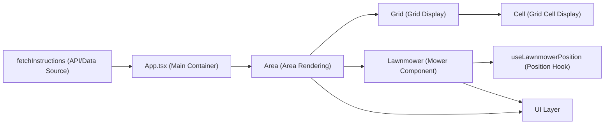

# Lawnmower Area Rendering Module

## Overview
This module is responsible for visually representing and managing a bounded area with one or more lawnmowers operating within it. It orchestrates the rendering of a grid-based area, positions multiple lawnmowers based on received instructions, tracks active selections, and supplies visual feedback regarding each lawnmower’s path and final position. The module is designed for interactive visual simulation, commonly used for demonstrations, testing or user-guided scenarios involving grid navigation.

## Key Features

- **Area Visualization**: Renders a dynamic grid based on configurable width and height, allowing users and systems to visualize the operational field.
- **Lawnmower Placement & Navigation**: Places one or more lawnmowers on the grid. Their positions, movements, and orientations are determined by initial instructions and can be tracked visually.
- **Active Lawnmower Management**: Tracks which lawnmower is currently active for interaction or highlighting, enabling user focus or step-wise control.
- **Positional Feedback**: Displays each lawnmower’s current and final position in the area, facilitating monitoring and instructional clarity.
- **Instruction Driven Rendering**: Accepts structured instructions (area size and mower details) from upstream systems to drive the rendering and configuration.

## System Errors

- **Missing Instructions**: If instructions (area size, mower data) are absent or malformed, the area may render with zero width/height, causing lawnmowers not to appear.
    - *Resolution*: Validate instructions before passing to the module. Use fallback defaults to ensure visibility.
- **Out-of-Bound Positioning**: If a lawnmower’s position exceeds grid boundaries, the mower may be rendered outside the area or not at all.
    - *Resolution*: Ensure validating incoming positions against area dimensions before rendering.
- **Rendering Failures**: CSS conflicts or missing class definitions can prevent correct grid or mower visualization.
    - *Resolution*: Confirm that all referenced styles are correctly loaded and available in the build.

## Usage Examples

```tsx
import Area from "./components/area/Area";

// Provide structured instructions:
const instructions = {
  areaHeight: 5,
  areaWidth: 5,
  lawnMowers: [
    { x: 2, y: 4, orientation: "N" },
    { x: 0, y: 0, orientation: "E" }
  ]
};

<Area instructions={instructions} />
```

```tsx
// Top-level integration with fetched instructions:
import { useEffect, useState } from "react";
import Area from "./components/area/Area";
import { fetchInstructions } from "./utils/fetchInstructions";

function App() {
  const [instructions, setInstructions] = useState();

  useEffect(() => {
    fetchInstructions().then(setInstructions);
  }, []);
  
  return <Area instructions={instructions} />;
}
```

## System Integration



**Integration notes**:  
- External systems provide instructions via fetchInstructions or similar APIs.
- App is the root orchestrator, feeding instructions into Area.
- Area manages grid rendering via Grid and populates lawnmower components, supported by position hooks for animation/feedback.
- The UI layer receives all rendered output for user interaction or visualization.