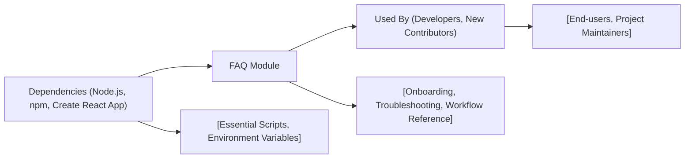

# FAQ Module

## Overview
The FAQ module provides answers to common questions and troubleshooting guidance for users interacting with the repository's setup and workflow. Its purpose is to streamline onboarding and provide quick reference points about standard operations and integration within the development environment configured by Create React App.

## Key Features
- **Quick Start Guidance**: Offers clear steps for launching and developing with Create React App, enabling newcomers to begin without confusion.
- **Common Workflow Reference**: Documents frequently used scripts (start, test, build, eject) and their contextual purpose in the development lifecycle.
- **Troubleshooting Support**: Supplies solutions to frequently encountered issues or errors during installation, running, or building the project.

## System Errors
- **Port Already In Use**: If you see an error that port `3000` is busy when starting the app, ensure no other processes are using the port or configure a different port.
    - **Resolution**: Stop the other process, or set the `PORT` environment variable to a new value before running `npm start`.
- **Build Failures (Syntax or Lint Errors)**: Errors during `npm run build` usually indicate coding or lint issues.
    - **Resolution**: Review the console output, fix reported problems in your code, and rerun the build.
- **Module Not Found**: When running scripts or tests, you may see missing module errors if dependencies aren't installed.
    - **Resolution**: Run `npm install` in the project directory to resolve missing dependencies.

## Usage Examples
Practical code examples showing how to use the main scripts:

```bash
# Start development server
npm start

# Run the test suite with interactive watch mode
npm test

# Build optimized production bundle
npm run build

# Eject configuration (irreversible)
npm run eject
```

## System Integration

