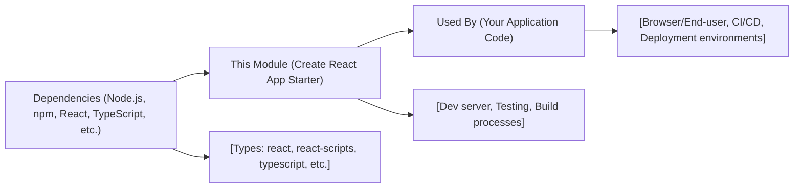

# Getting Started

## Overview
This starter module provides a streamlined environment for developing, testing, and building single-page applications using React and TypeScript. It uses Create React App as the foundation, abstracting away build tools and configuration so developers can focus on feature development. The module enables fast local development, testing, production builds, and easy custom configuration when needed.

## Key Features
- **Development Server**: Instantly launches a local development server with hot reloading for rapid feedback and iteration.
- **Production Build System**: Generates optimized, minified static assets ready for production deployment.
- **Integrated Testing**: Provides a pre-configured environment for running and watching tests alongside development.
- **Customizable Tooling**: Supports "ejecting" to take full control over configuration for advanced use cases.
- **TypeScript Support**: Out-of-the-box support for TypeScript, enabling type safety and modern JS features.
- **Ready-to-use HTML Template**: Includes a basic `index.html` template configured for React apps.

## System Errors
- **Port In Use**: The development server may fail to start if port 3000 is already in use.
  - *Resolution*: Stop other services using the port or specify a different port.
- **Build Failures**: Build may fail due to type errors, missing dependencies, or syntax issues.
  - *Resolution*: Check the terminal or browser console for specific error messages, fix code issues, and retry.
- **Eject Irreversibility**: Running the eject command is irreversible and exposes all configuration files.
  - *Resolution*: Use eject only when advanced customization is necessary and after backing up your project.

## Usage Examples
Practical code and command examples for using the starter module:

```sh
# Start the local development server on http://localhost:3000
npm start

# Run tests in watch mode
npm test

# Create an optimized production build in the 'build' directory
npm run build

# (Advanced) Eject configuration for custom setup (irreversible)
npm run eject
```

## System Integration


